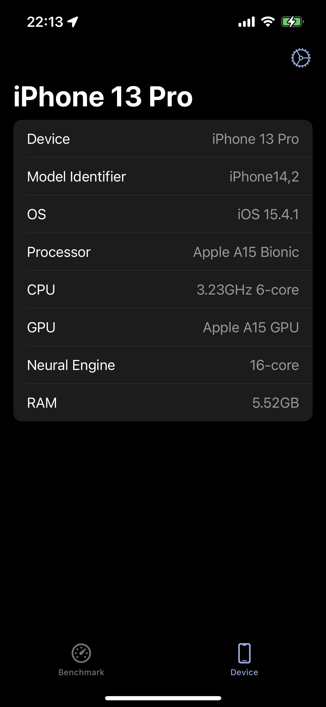

# App Library

<!------
### Template

|              |   |
|:------------ |:----------------------:|
| Repository   |  |
| Platform     | iOS                    |
| Project type | App                    |
| Screenshots  |  |
| Description  | |
------>                     

## Health

### Calories

|              |   |
|:------------ |:----------------------:|
| Repository   | [Calories](https://github.com/Shakshi3104/Calories) |
| Platform     | iOS                    |
| Project type | App                    |
| Screenshots  |  |
| Description  | See your intake and consumption energy on the Widget |

### Body Temperature

|              |   |
|:------------ |:----------------------:|
| Repository   | [BodyTemperature](https://github.com/Shakshi3104/BodyTemperature) |
| Platform     | watchOS                |
| Project type | App                    |
| Screenshots  |  |
| Description  | Body Temperature app for Apple Watch built in SwiftUI (Joke app) |

## Activity recognition

### Motion+CoreML

|              | <!---->  |
|:------------ |:----------------------:|
| Repository   | [Motion-CoreML](https://github.com/Shakshi3104/Motion-CoreML) |
| Platform     | iOS                    |
| Project type | App                    |
| Screenshots  | Under construction... <!----> |
| Description  | Classify activities from acceleration data with Core ML |

### Activitybench 3

|              | <!---->  |
|:------------ |:----------------------:|
| Repository   | [Activitybench](https://github.com/Shakshi3104/Activitybench) |
| Platform     | iOS, macOS (Catalyst)  |
| Project type | App                    |
| Screenshots  |  |
| Description  | Benchmarking convolutional neural networks for sensor-based human activity recognition on iPhone |

### Hopper

|              | <!---->  |
|:------------ |:----------------------:|
| Repository   | [Hopper](https://github.com/Shakshi3104/Hopper) |
| Platform     | watchOS, iOS           |
| Project type | App                    |
| Screenshots  | 
   
 |
| Description  | Detect motion on a trampoline from acceleration data with Core ML |

### footway

|              | <!---->  |
|:------------ |:----------------------:|
| Repository   | [footway](https://github.com/Shakshi3104/footway) |
| Platform     | iOS                    |
| Project type | App                    |
| Screenshots  |  |
| Description  | Classify sidewalk surface type from acceleration data with Core ML |

## Utilities

### Core Wafer

|              |   |
|:------------ |:----------------------:|
| Repository   | [CoreWafer](https://github.com/Shakshi3104/CoreWafer) |
| Platform     | macOS, iOS                    |
| Project type | Swift Package                  |
| Screenshots  |  |
| Description  | 🧇 Package for Gaufre and Waffle |
| Related package | [DeviceHardware](README.md#devicehardware), [ProcessorKit](README.md#processorkit) |

### Guafre

|              |   |
|:------------ |:----------------------:|
| Repository   | [Guafre](https://github.com/Shakshi3104/Gaufre) |
| Platform     | macOS                    |
| Project type | App                    |
| Screenshots  |  |
| Description  | 🧇 Check load of each core of CPU on your Mac menu bar. |

### DeviceHardware

|              | <!---->  |
|:------------ |:----------------------:|
| Repository   | [DeviceHardware]() |
| Platform     | iOS, macOS                    |
| Project type | Swift Package                    |
| Screenshots  |  |
| Description  | Package for getting iPhone, iPad and Mac model names and hardware information, such as SoC name. |

### devicehard

|              |   |
|:------------ |:----------------------:|
| Repository   | [devicehard](https://github.com/Shakshi3104/devicehard) |
| Platform     | macOS                    |
| Project type | Command Line Tool                    |
| Screenshots  |  |
| Description  | get hardware information of Mac devices | 

### ProcessorKit

|              |  |
|:------------ |:----------------------:|
| Repository   | [ProcessorKit](https://github.com/Shakshi3104/ProcessorKit) |
| Platform     | iOS, macOS             |
| Project type | Swift Package                    |
| Description  | package for getting CPU usage on iPhone, iPad, and Mac. |

### Battery XD

|              |   |
|:------------ |:----------------------:|
| Repository   | [BatteryXD](https://github.com/Shakshi3104/BatteryXD) |
| Platform     | iOS, watchOS           |
| Project type | App                    |
| Screenshots  |  |
| Description  | •ᴗ• Cute battery widget built in SwiftUI |

### Logger

|              | <!---->  |
|:------------ |:----------------------:|
| Repository   | [Logger7](https://github.com/Shakshi3104/Logger7) |
| Platform     | iOS, watchOS                    |
| Project type | App                    |
| Screenshots  | 
   
 |
| Description  | Accelerometer app built in SwiftUI, support for iPhone, Apple Watch and AirPods Pro |

## Image recognition

### Vision+ML SwiftUI

|              |  |
|:------------ |:----------------------:|
| Repository   | [Vision-ML-SwiftUI](https://github.com/Shakshi3104/Vision-ML-SwiftUI) |
| Platform     | iOS                    |
| Project type | App                    |
| Screenshots  |  |
| Description  | Classifying Images with Vision, Core ML and SwiftUI |
 

### Meat

|              | <!---->  |
|:------------ |:----------------------:|
| Repository   | [Meat-CoreML](https://github.com/Shakshi3104/Meat-CoreML) |
| Platform     | iOS                    |
| Project type | App                    |
| Screenshots  |  |
| Description  | classify meat parts from raw meat images |

### JohnnyFace

|              | <!---->  |
|:------------ |:----------------------:|
| Repository   | [JohnnyFace](https://github.com/Shakshi3104/JohnnyFace) |
| Platform     | iOS                    |
| Project type | App                    |
| Screenshots  |  |
| Description  | Detect Johnny's face with Core ML and Vision |
| Related repository | [isJohnnys](https://github.com/Shakshi3104/isJohnnys) |

### CornConeDetector

|              |  |
|:------------ |:-------------------------------------------------------------------------------------------------------------------:|
| Repository   | [CornConeDetector](https://github.com/Shakshi3104/CornConeDetector)                                                 |
| Platform     | iOS                                                                                                                 |
| Project type | App                                                                                                                 |
| Screenshots  |     |
| Description  | Detect corn (sweet corn) or cone (road cones, traffic cones or pylons).                                             |

## Image

### DepthMap

|              | <!---->  |
|:------------ |:----------------------:|
| Repository   | [DepthMap](https://github.com/Shakshi3104/DepthMap) |
| Platform     | iOS                    |
| Project type | App                    |
| Screenshots  |  |
| Description  | Obtain a depth map from a LiDAR scanner |

### DualDepth

|              | <!---->  |
|:------------ |:----------------------:|
| Repository   | [DualDepth](https://github.com/Shakshi3104/DualDepth) |
| Platform     | iOS                    |
| Project type | App                    |
| Screenshots  |  |
| Description  | Obtain a depth map from dual camera |

### DepthBrewer

|              |   |
|:------------ |:----------------------:|
| Repository   |  |
| Platform     | iOS, macOS              |
| Project type | App                    |
| Screenshots  | 
   
 |
| Description  | Obtain a depth map from a portrait image |

## Mock

### A・NA・TA for DREAM

|              | <!---->  |
|:------------ |:----------------------:|
| Repository   | [ANATAforDREAM](https://github.com/Shakshi3104/ANATAforDREAM) |
| Platform     | iOS                    |
| Project type | App                    |
| Screenshots  |  |
| Description  | mitate A・NA・TA for DREAM with SwiftUI |

### tamagotchOS

|              |   |
|:------------ |:----------------------:|
| Repository   | [tamagotchOS](https://github.com/Shakshi3104/tamagotchOS) |
| Platform     | iOS                    |
| Project type | App                    |
| Screenshots  |  |
| Description  | watchOS-like Tamagotchi Smart |

### TamagotchiPet

|              |   |
|:------------ |:----------------------:|
| Repository   | [TamagotchiPet](https://github.com/Shakshi3104/TamagotchiPet) |
| Platform     | iOS                    |
| Project type | App                    |
| Screenshots  |  |
| Description  | Keep Tamagotchi with Widget, built in SwiftUI |
